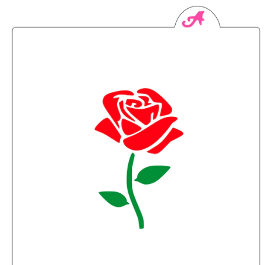
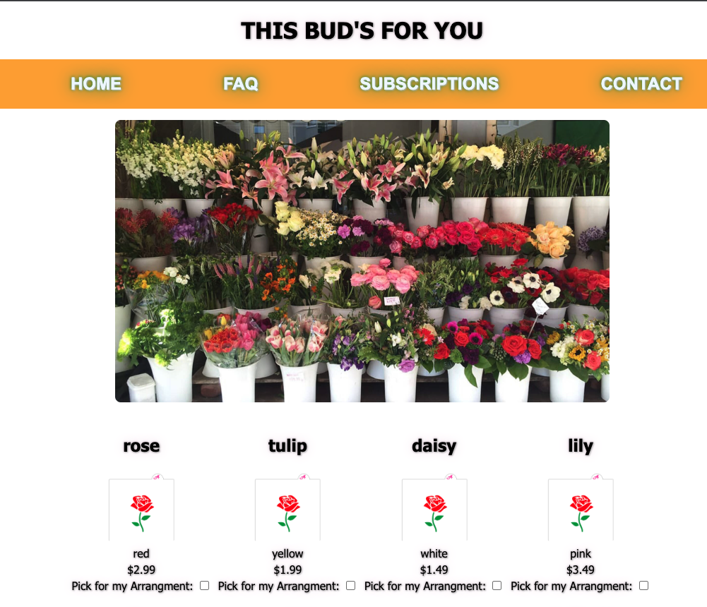

<p align="center">
 </a>
</p>

<h3 align="center">ga-flower-shop</h3>

<div align="center">

[]()
[](https://github.com/kylelobo/The-Documentation-Compendium/issues)
[](https://github.com/kylelobo/The-Documentation-Compendium/pulls)
[](/LICENSE)

</div>

<h1 align="center"> GA Hackathon - Flower Shop</h1>
<p align="center">
    </a>
</p>

## 📝 Table of Contents

- [About](#about)
- [Getting Started](#getting_started)
- [Built Using](#built_using)
- [Future improvements](#future)
- [Contributors](#Contributors)

## 🧐 About <a name = "about"></a>

In this group project/hackathon we aim to create a full crud app

## Goals

    Homepage - Most popular landing page
        Display - Inventory
            User Can see a list of all available flowers to select and select and create an arrangement based on the selection
            Right now user can select and crate, but we are not showing created arrangements on the UI but can be found in the DB
          (need to implement in UI)
            Filters:
            - User can sort by Colors (not implemented yet)
            - User can sort by Colors (not implemented yet)
            - User can Sort by price (not implemented yet)

    Stretch Goals
        Check out Page (not implemented yet)
        user can select and check out items
        User can pick more than one flower

## 🏁 Getting Started <a name = "getting_started"></a>

<h2> get you a copy of the project up and running on your local machine for development and testing purposes. </h2>

# Installing

## ⛏️ Built Using <a name = "built_using"></a>

- [MongoDB](https://www.mongodb.com/) - Database
  - mongoose - Database Framework
  - nodemon
- [Express](https://expressjs.com/) - Server Framework
- [NodeJs](https://nodejs.org/en/) - Server Environment
- [CORS](https://www.npmjs.com/package/cors) - Connect/Express middleware
- [Morgan](https://www.npmjs.com/package/morgan) - HTTP request logger middleware for node.js
- [Live Server](https://marketplace.visualstudio.com/items?itemName=ritwickdey.LiveServer) - A Quick Development Live Server with live browser reload.

make sure you have live Server extension install

Add the following script to your package.json

```sh
  "scripts":
            {
                "start": "node server.js",
                "dev": "nodemon server.js"
            },
```

## 🔧 Running the tests <a name = "tests"></a>

<h3 style="color:green;">Start the server with the follow command:</h3>

```sh
npm run dev
```
<h3>Start front-end server using the live server extension </h3>

## Database Structure
<p align="center">
    </a>
</p>

## Running App Screenshot
<p align="center">
    </a>
</p>

## 🚀 Future improvements <a name="future"></a>

1. Filter by color/ price.
2. A page/place to display created arrangements.
3. Price of the arrangement would reflect the total price of selected stems.

## ✍️ Contributors <a name = "contributors"></a>

- [@Shirin](https://github.com/shirinmjr)
- [@Josh](https://github.com/JoshHutchison)
- [@Darcy](https://github.com/darcystruble)
- [@Blen]()
